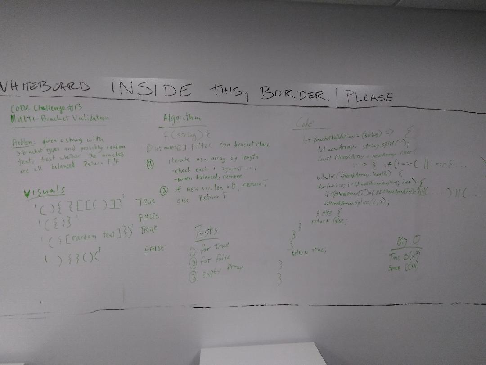
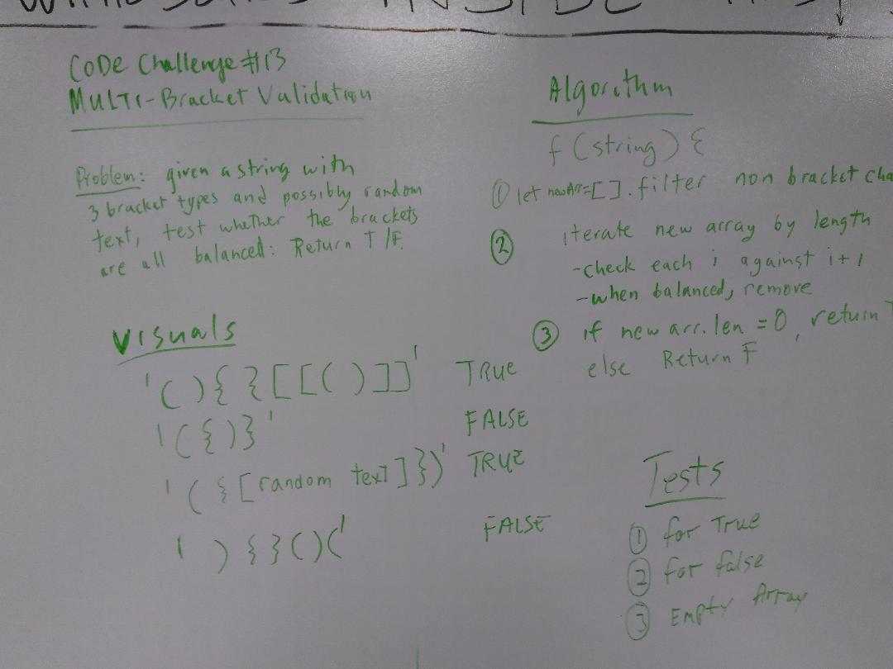
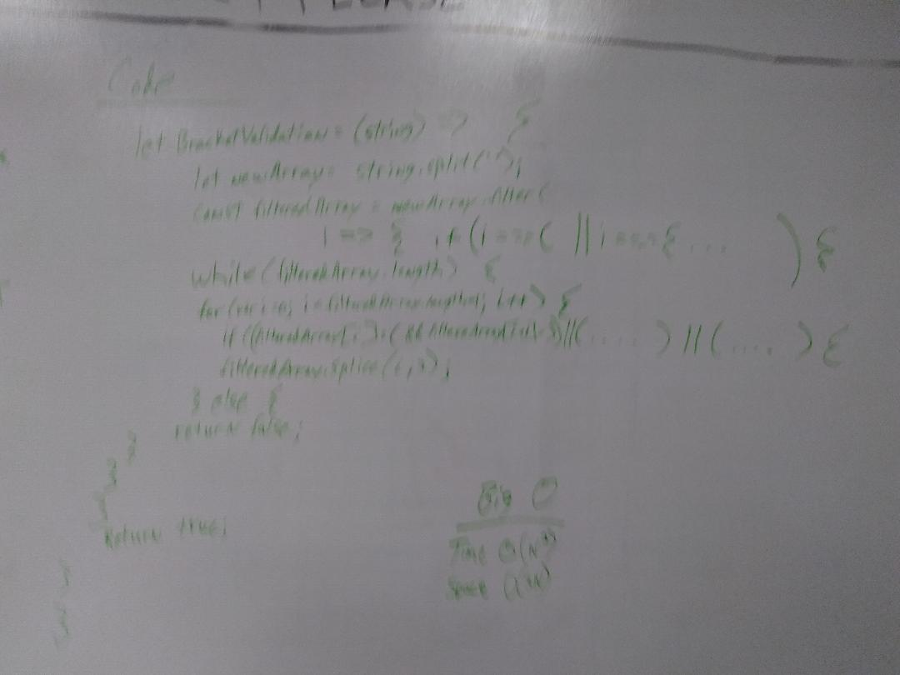

# Multi-bracket Validation.
I worked on this code challenge with Kevin O'Halloran.  Utilize the Single-responsibility principle: any methods you write should be clean, reusable, abstract component parts to the whole challenge. You will be given feedback and marked down if you attempt to define a large, complex algorithm in one function definition.

## Challenge
*Your function should take a string as its only argument, and should return a boolean representing whether or not the brackets in the string are balanced. There are 3 types of brackets:

*Round Brackets : ()
*Square Brackets : []
*Curly Brackets : {}

## Approach & Efficiency
I decided to first take the string and turn it into an array of each individual element. Then I filter out the extra characters. Thirdly I iterate through the array removing matching brackets one at a time until there is nothing left, resulting in a true. If there is anything left the code returns a false. I beleive the Big O is O(n2) for time and O(2n) for space.

## Solution

