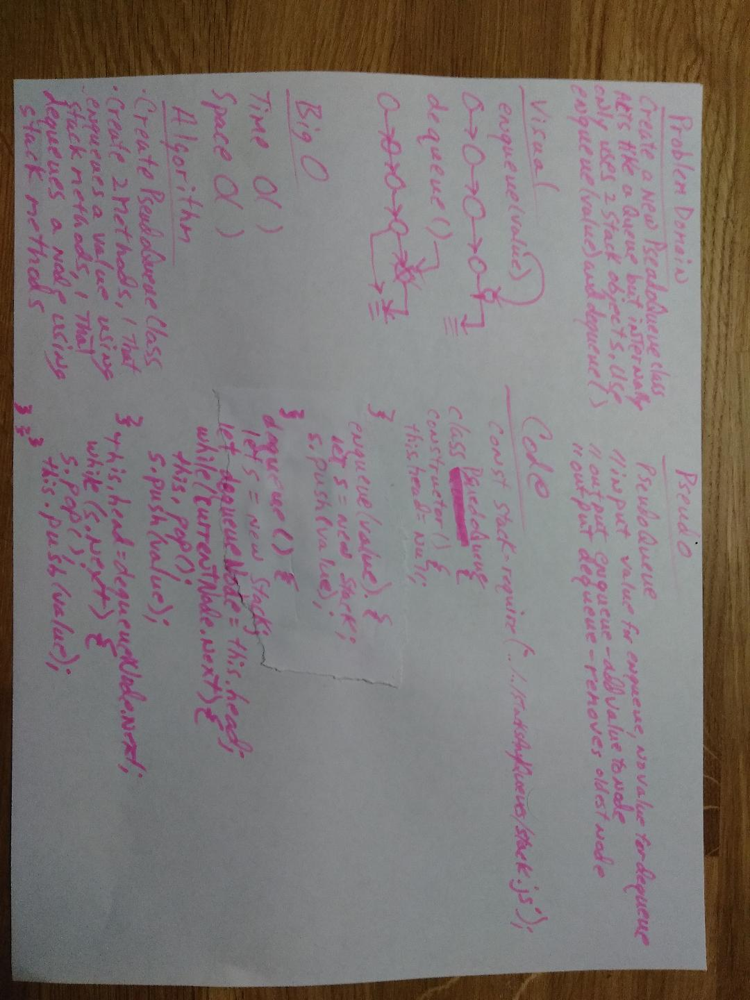

# Implement a Queue using two Stacks.
* Create a brand new PseudoQueue class. Do not use an existing Queue. Instead, this PseudoQueue class will implement the standard queue interface, but will internally only utilize 2 Stack objects. 

## Challenge
* Ensure that you create your class with the following methods:

* enqueue(value) which inserts value into the PseudoQueue, using a first-in, first-out approach.
* dequeue() which extracts a value from the PseudoQueue, using a first-in, first-out approach.
* The Stack instances have only push, pop, and peek methods. You should use your own Stack implementation. Instantiate these Stack objects in your PseudoQueue constructor.

## Approach & Efficiency
* I am doing this weeks code challenges by myself, since I'm doing most of it at home and everyone else seems to have partnered up already
* I am using the same run.js file, now in a test directory to make sure the code is working before submitting it.

## Solution
