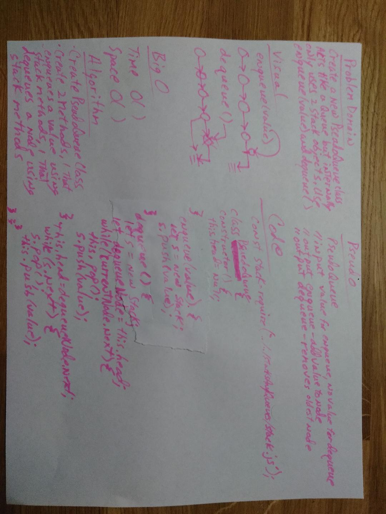

# Stacks and Queues
Stacks and Queues are normally built and minipulated like arrays, the challenge here is to build and minipulate them as if they were LinkedLists

## Challenge
* Create a Node class that has properties for the value stored in the Node, and a pointer to the next node
* Create a Stack class that has a top property. It creates an empty Stack when instantiated.
* This object should be aware of a default empty value assigned to top when the stack is created.
* Define a method called push which takes any value as an argument and adds a new node with that value to the top of the stack with an O(1) Time performance.
* Define a method called pop that does not take any argument, removes the node from the top of the stack, and returns the node.
* Define a method called peek that does not take an argument and returns the node located on the top of the stack.
* Create a Queue class that has a top property. It creates an empty queue when instantiated.
* This object should be aware of a default empty value assigned to front when the queue is created.
* Define a method called enqueue which takes any value as an argument and adds a new node with that value to the back of the queue with an O(1) Time performance.
* Define a method called dequeue that does not take any argument, removes the node from the front of the queue, and returns the node.
* Define a method called peek that does not take an argument and returns the node located in the front of the stack.

## Approach & Efficiency
While some of the other students decided to call upon the LinkedList built previously to accomplish this challenge, I decided to rebuild it from scratch. There are two reasons for this, I have not finished the linked list lab and I wanted to understand it better, so I decided to build these functions from scratch.  I created a run.js file to test the different parts of the stacks and queues for now with all of the calls quoeted out until needed for testing.

## API

### Stack
* Has a top prooperty with an empty value.

### Push
* Is a method that takes a value and adds a new node with that value to the top of the stack.

### Pop
* Is a method that takes the top node off of the stack.

### Peek
* Returns the node at the top of the stack.

### Queue
* Has a top property with an empty value.

### Enqueue
* Is a method that takes a value and adds a new node with that value to the back of the queue.

### Dequeue
* Is a method that takes the front node off of the queue.

### Peek
* Returns the node at the front of the queue.

## Solution

