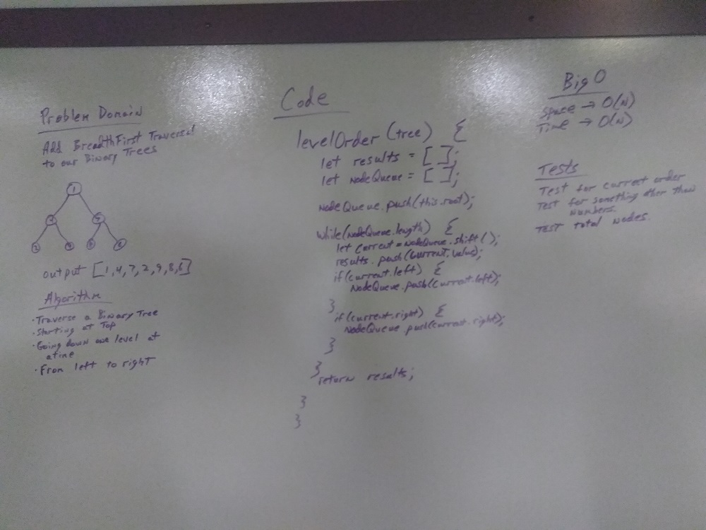

# Breadth-first Traversal.
Build upon our BinaryTree class

## Challenge
Check all nodes by level with the root first.

## Approach & Efficiency
* I iterated through the tree, starting with the root.
* I add nodes to a nodeQueue and pull them off one at a time putting them in a results variable in order one level at a time
* The Big O for Space is O(n), and the big O for time is O(n).
* Tests are run by entering 'npm run test' on the command line.

## Solution
