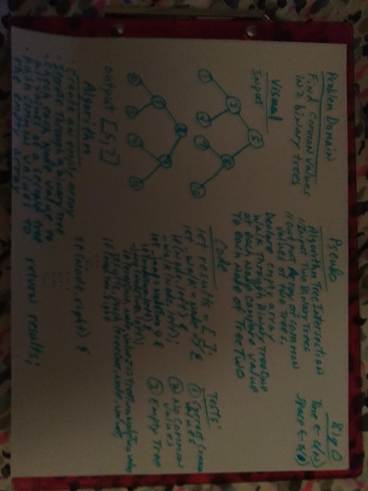

# Intersection of binary trees
 * Create a branch in your repository called tree_intersection
 * On your branch, create a folder named treeIntersection which contains a file called tree-intersection.js

## Challenge
Find common values in 2 binary trees

## Approach & Efficiency
I decided to start traversing through the first binary tree compairing the value of each branch to the values in the second binary tree and each matching value is pushed into an array of common values.

## Solution
